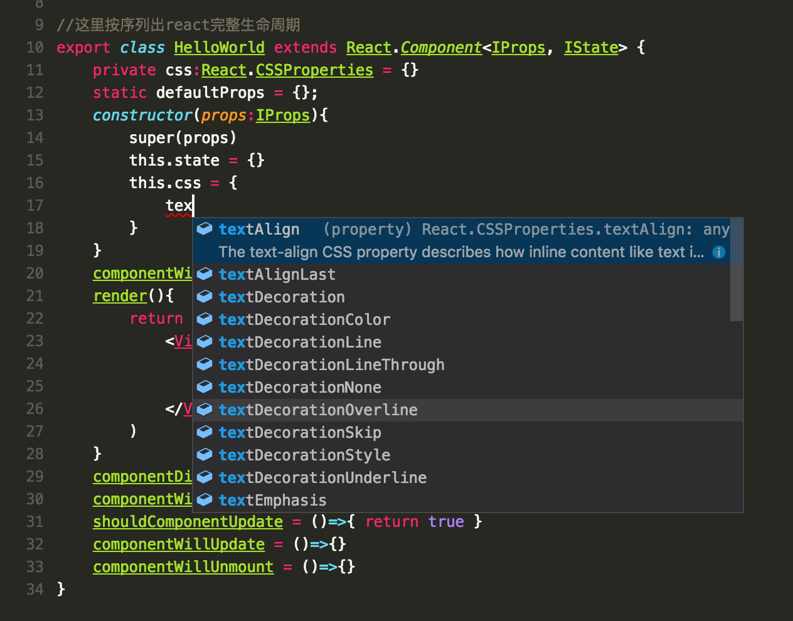

#react-kua

[English Readme](./README.md)
# kua
(此项目正在填坑中...)
kua是一个基于react的跨平台**集成方案**, 思路是让移动端和pc端使用同一套代码, 适配同样的设计.这一切都是基于web.
因为相信Web是最终跨平台解决方案.

# Install
```
npm i -g react-kua-cli
```
# Create project
```
mkdir projectName & cd projectName
npm init
```

# Use
```
kua web
```


# 用到的包
- 语言使用typescript
- 打包工具使用webpack
- 开发服务器使用webpack-dev-server
- UI框架使用react
- UI组件使用react-ymui-kit
- 路由使用react-router
- 动画使用react-motion

# 关于react-ymui-kit(还未完善,填坑中)
kua提供一套UI组件, 使用此组件达到跨平台的目的
react-ymui-kit设计理念分为三个层级:

## 1. basic, 基础层级
适配移动端的触碰操作, 设计移动和web通用的基础控件

## 2. design, 设计层级
使用basic控件, 和一套设计语言设计带设计的基础控件.
design层可以有多个分支,根据不同的项目,业务的需要使用不同风格的控件

## 3. fit, 组装层级
应用层, 应用层会使用design控件, 完成一些最终可以直接使用的复杂控件, 例如导航栏, 时间选择器等等

## 扩展性
- 根据未来不同的平台, 适配更多平台的basic组件
- 根据basic层, 可以扩展多个design分支
- 完善更多的fit组件, 并且fit组件输入不同的design分支, 可以得到全新的视觉

# 关于tool
tool是kua提供一系列糖果类小工具

# 为什么用TypeScript?
有了类型检测, 我们能够更加安全,快速的进行JavaScript开发.

特别是配合VScode, 如图:

- 如图, 识别Html css

- react的箭头函数中识别Props
